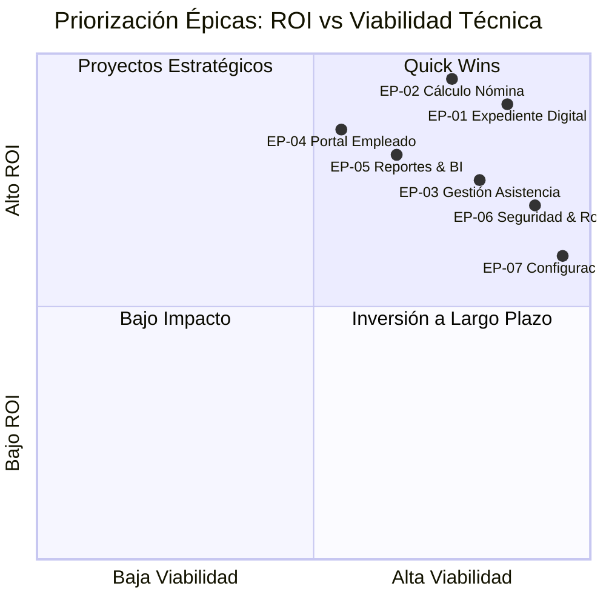

# 🏢 Product Backlog — Módulo Talento Humano
### Inversiones Avante · Transformación Digital RRHH
**Stack:** Next.js 14 (App Router) · PostgreSQL · Prisma ORM  
**Product Owner:** Rol PO Experto · Fecha: Marzo 2026  
**Metodología:** Scrum · Sprints de 2 semanas

---

## 📊 Estado del Producto (Baseline)

| Módulo | Rutas API | UI Pages | DB Models | Estado |
|--------|-----------|----------|-----------|--------|
| Empleados | `/api/employees-data` | `employees/`, `employees/[id]/edit` | `Employee`, `SalaryHistory`, `EmployeeDocument` | ✅ Done |
| Configuración Org. | `/api/config/departments`, `positions`, `shifts` | `config/departments` | `Department`, `Position`, `Shift`, `Gerencia` | ✅ Done |
| Nómina | `/api/payroll`, `/api/payroll-runs` | `payroll/`, `payroll/incidents` | `PayrollRun`, `PayrollRunEmployee`, `PayrollIncident` | ✅ Done |
| Asistencia | `/api/attendance` | `attendance/` | `Attendance`, `Shift` | ✅ Done |
| Administración | `/api/admin` | `admin/` | `User`, `Role`, `Permission` | ✅ Done |
| Localización | `/api/localization` | `localization/` | `Country`, `Currency`, `TaxTable` | 🟡 En desarrollo |

---

## 🗺️ Mapa de Épicas — Priorización MoSCoW × ROI



---

## 📋 BACKLOG DE ÉPICAS (Ordenado por Prioridad)

---

### 🔴 EP-01 · Expediente Digital del Empleado
**Prioridad:** MUST HAVE · **ROI:** ★★★★★  
**Objetivo de negocio:** Digitalizar y centralizar el 100% de la información del colaborador, eliminando expedientes físicos y reduciendo tiempo de búsqueda de 15 min → < 30 seg.

| # | User Story | SP | Sprint | Prioridad | Estado |
|---|------------|-------|--------|-----------|--------|
| US-01.1 | Alta de empleado con validación de documentos legales | 8 | S01 | Critical | ✅ Done |
| US-01.2 | Visualización de expediente 360° por empleado | 5 | S01 | Critical | ✅ Done |
| US-01.3 | Carga y categorización de documentos digitales | 8 | S02 | High | ✅ Done |
| US-01.4 | Historial de salarios con trazabilidad de cambios | 3 | S02 | High | ✅ Done |
| US-01.5 | Gestión de jerarquía y organigrama dinámico | 5 | S03 | Medium | 🟡 WIP |
| US-01.6 | Alertas de documentos próximos a vencer | 5 | S03 | Medium | 🟡 WIP |

---

#### US-01.1 · Alta de Empleado con Validación de Documentos Legales

**Como** Gerente de RRHH  
**Quiero** registrar un nuevo empleado con todos sus datos personales, contractuales e identidad legal  
**Para** asegurar que el expediente cumpla con los requerimientos del Ministerio de Trabajo de El Salvador desde el primer día

**Criterios de Aceptación:**

```gherkin
Scenario: Registro exitoso de empleado nuevo
  Given el usuario tiene rol "HR_MANAGER" o "ADMIN"
  And el formulario de nuevo empleado está abierto en /employees/new
  When completa los campos requeridos: firstName, firstSurname, dui, hireDate, positionId, locationId, countryId
  And hace clic en "Guardar Empleado"
  Then el sistema crea el registro en la tabla Employee con status = ACTIVE
  And genera automáticamente un employeeCode único con formato "EMP-XXXXXX"
  And redirige al usuario al expediente del empleado recién creado (/employees/[id])
  And muestra el message "Empleado registrado exitosamente"

Scenario: Validación de DUI duplicado
  Given ya existe un empleado con dui = "01234567-8"
  When se intenta dar de alta otro empleado con el mismo DUI
  Then el sistema retorna HTTP 409 Conflict
  And muestra el mensaje de error: "El DUI ingresado ya se encuentra registrado"
  And el formulario no se envía

Scenario: Campos requeridos faltantes
  Given el formulario de alta está parcialmente llenado
  When el usuario omite el campo hireDate o positionId
  Then el formulario muestra validación inline: "Este campo es requerido"
  And el botón Guardar permanece desactivado hasta que todos los campos requeridos estén completos

Scenario: Registro de emergencia sin DUI
  Given el usuario está registrando un empleado extranjero
  When el campo DUI está vacío pero NIT y Pasaporte están llenos
  Then el sistema acepta el registro sin DUI
  And guarda una nota de alerta "DUI pendiente de presentación"
```

**Notas técnicas:**
- Endpoint: `POST /api/employees-data`
- Validación con Zod schema en el API Route
- `employeeCode` generado con `nanoid(6)` con prefijo configurable
- Indexar `dui`, `nit`, `isssNumber` como UNIQUE en PostgreSQL (ya modelado en schema)

---

#### US-01.2 · Expediente 360° del Empleado

**Como** Supervisor o Gerente de RRHH  
**Quiero** ver en una sola vista toda la información de un empleado: datos personales, historial salarial, documentos, préstamos y obligaciones  
**Para** tomar decisiones informadas sin necesidad de consultar múltiples sistemas

**Criterios de Aceptación:**

```gherkin
Scenario: Vista completa del expediente
  Given el usuario accede a /employees/[id]
  When el id corresponde a un empleado existente
  Then la página muestra tabs organizados: "Personal" | "Contractual" | "Documentos" | "Financiero" | "Historial"
  And la pestaña "Personal" muestra: nombre completo, DUI, NIT, ISSS, NUP, dirección, teléfono, contacto de emergencia
  And la pestaña "Contractual" muestra: fechaIngreso, puesto, gerencia, departamento, jornada, tipo de contrato
  And la pestaña "Financiero" muestra: salario actual, historial de salarios, préstamos activos, obligaciones financieras

Scenario: Empleado no encontrado
  Given el id en la URL no existe en la base de datos
  Then la página retorna un 404 friendly con mensaje "Empleado no encontrado"
  And ofrece un botón "Volver al listado"

Scenario: Control de acceso por rol
  Given el usuario tiene rol "EMPLOYEE" (empleado base)
  When accede a /employees/[id] siendo [id] diferente a su propio employeeId
  Then el sistema retorna HTTP 403 Forbidden
  And redirige al portal del empleado propio
```

**Notas técnicas:**
- Usar `select` de Prisma para cargar relaciones lazy: `salaryHistory`, `documents`, `loans`, `financialObligations`
- Implementar caching con `unstable_cache` de Next.js para datos no volátiles del perfil

---

#### US-01.3 · Carga y Gestión de Documentos Digitales

**Como** Asistente de RRHH  
**Quiero** subir y categorizar documentos escaneados del empleado (DUI, contratos, títulos académicos)  
**Para** eliminar el expediente físico y tener acceso digital inmediato ante auditorías

**Criterios de Aceptación:**

```gherkin
Scenario: Subida exitosa de documento
  Given el usuario está en la pestaña "Documentos" del expediente
  When selecciona categoría = "IDENTIFICATION", título = "DUI Frontal" y adjunta un PDF/imagen < 10MB
  And hace clic en "Subir Documento"
  Then el archivo se almacena en la ruta configurada (S3 o FileSystem local)
  And se crea un registro EmployeeDocument con fileUrl, category, title, uploadDate
  And el documento aparece en la lista con fecha, categoría y opción de descarga/preview

Scenario: Validación de tipo y tamaño de archivo
  Given el usuario intenta subir un archivo .exe o mayor a 10MB
  Then el sistema rechaza la subida con mensaje: "Solo se permiten archivos PDF, JPG o PNG de hasta 10MB"

Scenario: Categorías disponibles
  Then las categorías disponibles son: IDENTIFICATION | CONTRACTUAL | ACADEMIC | PAYROLL | LEGAL
```

**Notas técnicas:**
- Endpoint: `POST /api/employees-data/[id]/documents`
- Usar `formidable` o `busboy` para multipart form data en Next.js API
- Almacenamiento: definir variable de entorno `STORAGE_PROVIDER` = `local` | `s3`
- FileUrl relativa: `/uploads/employees/[employeeId]/[timestamp]-[filename]`

---

### 🔴 EP-02 · Motor de Cálculo de Nómina
**Prioridad:** MUST HAVE · **ROI:** ★★★★★  
**Objetivo de negocio:** Automatizar el 95% del cálculo quincenal/mensual, reducir errores de nómina de ~8% actual estimado a < 0.5% y tener planilla lista en 2 horas vs. 2 días.

| # | User Story | SP | Sprint | Prioridad |
|---|------------|-------|--------|-----------|
| US-02.1 | Configuración de períodos de nómina (quincenal/mensual) | 5 | S02 | Critical |
| US-02.2 | Motor de cálculo: salario base + deducciones ISSS/AFP/ISR | 13 | S02-S03 | Critical |
| US-02.3 | Registro masivo de incidencias (llegadas tarde, ausencias, bonos) | 8 | S03 | High |
| US-02.4 | Vista previa y aprobación de planilla antes de cierre | 8 | S03 | High |
| US-02.5 | Generación de comprobante de pago (recibo) por empleado | 5 | S04 | High |
| US-02.6 | Cálculo automático de ISR según tabla activa El Salvador | 8 | S04 | Critical |
| US-02.7 | Exportación a banco (layout ACH/transferencias) | 8 | S05 | Medium |
| US-02.8 | Liquidación laboral: vacaciones, indemnización, proporcionales | 13 | S06 | High |

---

#### US-02.2 · Motor de Cálculo de Nómina

**Como** Coordinador de Nómina  
**Quiero** ejecutar el cálculo automático de nómina para un período seleccionado  
**Para** obtener el pago neto de cada empleado considerando todas las deducciones legales de El Salvador

**Criterios de Aceptación:**

```gherkin
Scenario: Cálculo quincenal exitoso
  Given existe un PayrollRun en status = "DRAFT" para el período 01/03/2026 - 15/03/2026
  And todos los empleados activos están incluidos en PayrollRunEmployee
  When el coordinador hace clic en "Calcular Nómina"
  Then el sistema calcula para cada empleado:
    - earnedSalary = (baseSalary / planHours) × workedHours
    - isssHealthDeduction = earnedSalary × 3.0% (tope ISSS: $30.00)
    - afpDeduction = earnedSalary × 7.25% (CRECER o CONFIA según empleado)
    - incomeTax = según tabla TaxTable BIWEEKLY activa para El Salvador
    - netPay = earnedSalary + totalBenefits - totalDeductions
  And el status del PayrollRun cambia a "PROCESSED"
  And guarda los resultados en PayrollRunEmployee

Scenario: Validación antes de calcular
  Given hay empleados en el PayrollRun sin salario histórico registrado
  When se intenta calcular
  Then el sistema bloquea el cálculo y muestra lista de empleados con datos faltantes
  And no modifica ningún registro existente

Scenario: Recálculo tras correcciones
  Given el PayrollRun está en status "PROCESSED"
  When se modifica una incidencia y se vuelve a calcular
  Then el sistema recalcula solo los empleados afectados
  And mantiene un log de auditoría con el timestamp del recálculo y usuario que lo ejecutó

Scenario: Tope de ISSS aplicado correctamente
  Given el salario mensual del empleado es $2,000.00 (tope ISSS = $1,000 base mensual)
  When se calcula el aporte ISSS quincenal
  Then isssHealthDeduction = $15.00 (3% de $500, que es el tope quincenal)
  And no aplica el 3% sobre el salario completo si supera el tope
```

**Notas técnicas:**
- Función pura `calculatePayroll(employee, incidents, taxTable): PayrollResult`
- Separar lógica de cálculo en `/src/lib/payroll-engine.ts` (testeable unitariamente)
- Las tasas AFP/ISSS como constantes en `/src/lib/constants/salary-rules.ts`
- Usar `Decimal.js` para evitar errores de punto flotante en todos los montos

---

#### US-02.6 · Cálculo de ISR — Tabla Fiscal El Salvador

**Como** Sistema  
**Quiero** aplicar automáticamente la tabla de ISR vigente  
**Para** cumplir con las obligaciones tributarias del Ministerio de Hacienda de El Salvador

**Criterios de Aceptación:**

```gherkin
Scenario: Cálculo ISR dentro de primer tramo
  Given la renta imponible quincenal del empleado es $400.00
  And la tabla TaxBracket BIWEEKLY activa tiene: fromAmount=0, toAmount=487.50, fixedAmount=0, percentage=0, excessOf=0
  When se aplica el cálculo ISR
  Then incomeTax = $0.00

Scenario: Cálculo ISR en tramo progresivo
  Given la renta imponible quincenal es $1,200.00
  And el tramo aplicable tiene: fixedAmount=$57.10, percentage=20%, excessOf=$895.24
  When se aplica el cálculo
  Then incomeTax = $57.10 + ((1200 - 895.24) × 20%) = $57.10 + $60.95 = $118.05

Scenario: Tabla ISR configurable
  Given el administrador actualiza los valores de TaxBracket
  When se ejecuta nómina
  Then el sistema usa SIEMPRE la TaxTable con isActive=true para el país y frecuencia correspondiente
```

---

#### US-02.3 · Registro Masivo de Incidencias

**Como** Asistente de Nómina  
**Quiero** registrar incidencias (llegadas tarde, ausencias, bonos, comisiones) de forma individual o masiva  
**Para** reflejar estas variaciones en el cálculo de la nómina del período

**Criterios de Aceptación:**

```gherkin
Scenario: Registro individual de incidencia
  Given el usuario está en /payroll/incidents
  When selecciona empleado, tipo = LLEGADA_TARDE, cantidad = 45 (minutos) y fecha
  Then se crea un PayrollIncident asociado al PayrollRun activo
  And el monto se calcula automáticamente: (baseSalary / (8h × días laborables)) × (minutos/60)

Scenario: Marcar empleados sin incidencias como "Procesados" (Bulk)
  Given el usuario selecciona múltiples empleados con checkbox en la lista
  When hace clic en "Marcar como Procesado"
  Then todos los empleados seleccionados quedan marcados con status "PROCESSED" en PayrollRunEmployee
  And se registra en log: usuario, timestamp, lista de empleados procesados

Scenario: Importación de incidencias desde CSV
  Given el usuario carga un archivo CSV con columnas: employeeCode, tipo, cantidad, fecha, notas
  When el sistema procesa el archivo
  Then crea PayrollIncident para cada fila válida
  And reporta en pantalla: X registros creados, Y errores con detalle por fila
```

---

### 🟡 EP-03 · Gestión de Asistencia y Horarios
**Prioridad:** MUST HAVE · **ROI:** ★★★★☆  
**Objetivo de negocio:** Controlar la asistencia del 100% de empleados, alimentar automáticamente el cálculo de nómina y reducir disputas de horas trabajadas.

| # | User Story | SP | Sprint | Prioridad |
|---|------------|-------|--------|-----------|
| US-03.1 | Registro manual de asistencia diaria por empleado | 5 | S03 | Critical |
| US-03.2 | Definición y asignación de turnos (Shift) por empleado/depto | 5 | S02 | High |
| US-03.3 | Cálculo automático de minutos tarde y horas extra | 8 | S04 | High |
| US-03.4 | Vista de reporte mensual de asistencia por empleado | 5 | S04 | High |
| US-03.5 | Integración asistencia → incidencias de nómina | 8 | S05 | High |
| US-03.6 | Importación de marcajes desde dispositivo biométrico (CSV/TXT) | 8 | S06 | Medium |

---

#### US-03.3 · Cálculo de Minutos Tarde y Horas Extra

**Como** Sistema de Asistencia  
**Quiero** calcular automáticamente los minutos de tardanza y horas extra al registrar un marcaje  
**Para** alimentar de forma precisa el módulo de incidencias de nómina

**Criterios de Aceptación:**

```gherkin
Scenario: Marcaje con tardanza dentro de período de gracia
  Given el turno define startTime = "08:00" y gracePeriod = 15 minutos
  When el empleado registra clockIn = "08:12"
  Then Attendance.status = PRESENT
  And Attendance.lateMinutes = 0 (dentro del período de gracia)

Scenario: Marcaje con tardanza fuera de período de gracia
  Given el turno define startTime = "08:00" y gracePeriod = 15 minutos
  When el empleado registra clockIn = "08:20"
  Then Attendance.status = LATE
  And Attendance.lateMinutes = 20 (calculado desde 08:00, no desde fin de gracia)

Scenario: Cálculo de horas extra
  Given el turno define endTime = "17:00"
  When el empleado registra clockOut = "19:30"
  Then Attendance.overtimeMinutes = 150 (2.5 horas)
  And se crea automáticamente un PayrollIncident de tipo EXTRA_DIURNA si overtimeMinutes > 30

Scenario: Restricción de doble marcaje
  Given el empleado ya tiene un registro de Attendance para la fecha de hoy
  When intenta registrar un segundo clockIn
  Then el sistema actualiza el clockIn existente si es un ajuste administrativo
  And requiere justificación/notas para el ajuste
```

---

### 🟡 EP-04 · Portal de Autoservicio del Empleado
**Prioridad:** SHOULD HAVE · **ROI:** ★★★★☆  
**Objetivo de negocio:** Reducir en 60% las consultas directas a RRHH, empoderando al empleado para acceder a su información y gestionar solicitudes.

| # | User Story | SP | Sprint | Prioridad |
|---|------------|-------|--------|-----------|
| US-04.1 | El empleado puede ver su expediente personal (solo lectura) | 3 | S04 | High |
| US-04.2 | Descarga de comprobante de pago (recibo de nómina) | 5 | S05 | High |
| US-04.3 | Solicitud de vacaciones con flujo de aprobación | 8 | S05 | Medium |
| US-04.4 | Consulta de saldos: vacaciones disponibles, préstamos | 3 | S05 | Medium |
| US-04.5 | Actualización de datos personales (teléfono, banco, emergencias) | 5 | S06 | Medium |

---

#### US-04.3 · Solicitud de Vacaciones con Flujo de Aprobación

**Como** Empleado  
**Quiero** solicitar mis días de vacaciones desde el portal con fechas específicas  
**Para** planificar mi descanso sin necesidad de ir físicamente a RRHH

**Criterios de Aceptación:**

```gherkin
Scenario: Solicitud de vacaciones enviada exitosamente
  Given el empleado tiene saldo de vacaciones acumuladas > 0 días
  When en su portal selecciona fecha inicio y fecha fin para vacaciones
  Then el sistema calcula los daysTaken (excluyendo fines de semana y festivos)
  And crea un registro Vacation con status = "PENDING"
  And notifica por email al supervisor directo (managerId) para aprobación

Scenario: Saldo insuficiente de vacaciones
  Given el empleado tiene 5 días acumulados
  When solicita 7 días de vacaciones
  Then el sistema rechaza la solicitud con mensaje "Saldo insuficiente: tienes 5 días disponibles"

Scenario: Aprobación por supervisor
  Given la solicitud tiene status = "PENDING"
  When el supervisor aprueba en el panel /admin/vacations
  Then el status cambia a "APPROVED"
  And el empleado recibe notificación: "Tu solicitud de vacaciones del [fecha] ha sido aprobada"

Scenario: Cálculo de días de vacaciones acumulados
  Given el empleado tiene 2 años de antigüedad (según hireDate)
  Then el sistema muestra: 15 días disponibles (proporcional según Código de Trabajo de El Salvador)
```

---

### 🟡 EP-05 · Reportes y Business Intelligence
**Prioridad:** SHOULD HAVE · **ROI:** ★★★★☆  
**Objetivo de negocio:** Proveer al equipo directivo visibilidad en tiempo real sobre masa salarial, rotación y cumplimiento legal.

| # | User Story | SP | Sprint | Prioridad |
|---|------------|-------|--------|-----------|
| US-05.1 | Dashboard ejecutivo: headcount, masa salarial, rotación | 8 | S05 | High |
| US-05.2 | Reporte de nómina consolidado por período | 5 | S04 | High |
| US-05.3 | Reporte ISSS / AFP para presentación institucional | 8 | S05 | Critical |
| US-05.4 | Reporte de asistencia mensual por departamento | 5 | S05 | Medium |
| US-05.5 | Exportación a Excel/PDF de cualquier reporte | 5 | S05 | High |
| US-05.6 | Alertas automáticas: documentos vencidos, contratos próximos a vencer | 5 | S06 | Medium |

---

#### US-05.3 · Reporte ISSS/AFP Institucional

**Como** Coordinador de Nómina  
**Quiero** generar el reporte oficial de aportes ISSS y AFP por período  
**Para** presentarlo ante las instituciones (ISSS, AFP Crecer, AFP Confia) cumpliendo los plazos legales

**Criterios de Aceptación:**

```gherkin
Scenario: Generación de planilla ISSS
  Given el PayrollRun del período tiene status = "CLOSED"
  When el coordinador selecciona "Generar Reporte ISSS"
  Then el sistema produce un archivo en formato requerido por el ISSS con:
    - isssNumber del empleado
    - salario devengado del período
    - aporte empleado (3%)
    - aporte patronal (7.5%)
  And el archivo es descargable en formato .txt o .csv según especificación ISSS

Scenario: Validación de empleados sin número ISSS
  Given hay empleados en el PayrollRun sin isssNumber registrado
  When se genera el reporte
  Then el sistema incluye estos empleados con alerta visual
  And genera un resumen de "Empleados con datos faltantes para ISSS"
```

---

### 🟢 EP-06 · Seguridad, Roles y Auditoría
**Prioridad:** MUST HAVE · **ROI:** ★★★☆☆  
**Objetivo de negocio:** Asegurar acceso basado en roles, trazabilidad de cambios y cumplimiento de políticas de seguridad de datos.

| # | User Story | SP | Sprint | Prioridad |
|---|------------|-------|--------|-----------|
| US-06.1 | Autenticación con usuario/contraseña + JWT sessions | 8 | S01 | Critical |
| US-06.2 | Gestión de roles y permisos (ADMIN, HR_MANAGER, PAYROLL, EMPLOYEE) | 8 | S01 | Critical |
| US-06.3 | Asignación de empleado-usuario por unidad organizativa | 5 | S02 | High |
| US-06.4 | Log de auditoría para cambios en nómina y expediente | 8 | S04 | High |
| US-06.5 | Recuperación de contraseña y bloqueo por intentos fallidos | 5 | S03 | Medium |

---

#### US-06.1 · Autenticación con JWT Sessions

**Como** Usuario del sistema  
**Quiero** iniciar sesión con mi correo y contraseña corporativos  
**Para** acceder únicamente a los módulos y datos permitidos según mi rol en la organización

**Criterios de Aceptación:**

```gherkin
Scenario: Login exitoso
  Given el usuario existe en la tabla User con isActive = true
  When ingresa email y password correctos en /login
  Then el sistema valida passwordHash con bcrypt
  And crea una sesión JWT con payload: userId, locationId (default), roleId
  And redirige a /dashboard

Scenario: Credenciales incorrectas
  Given el usuario ingresa una contraseña incorrecta
  When hace clic en "Iniciar Sesión"
  Then el sistema muestra "Credenciales inválidas" sin especificar si es email o contraseña
  And registra el intento fallido (para bloqueo en US-06.5)

Scenario: Usuario con acceso multi-unidad
  Given el usuario tiene UserUnitAssignments en múltiples Location
  When hace login exitoso
  Then el sistema muestra un selector de "Unidad de trabajo" antes de ir al dashboard
  And la sesión JWT incluye el locationId seleccionado como contexto activo

Scenario: Sesión expirada
  Given el token JWT ha expirado (configurable, default 8 horas)
  When el usuario intenta acceder a cualquier ruta protegida
  Then el middleware de Next.js redirige a /login con mensaje "Sesión expirada, ingrese nuevamente"
```

---

### 🟢 EP-07 · Configuración Organizativa
**Prioridad:** MUST HAVE (prerequisito) · **ROI:** ★★★☆☆  
**Objetivo de negocio:** Establecer la estructura base (Organization → Location → Gerencia → Department → Position) que todos los demás módulos requieren.

| # | User Story | SP | Sprint | Prioridad |
|---|------------|-------|--------|-----------|
| US-07.1 | CRUD de Departamentos con asignación a Gerencia | 3 | S01 | Critical |
| US-07.2 | CRUD de Puestos/Posiciones por Departamento | 3 | S01 | Critical |
| US-07.3 | CRUD de Turnos con horario y período de gracia | 3 | S01 | Critical |
| US-07.4 | Configuración de tabla ISR por país y frecuencia | 5 | S02 | Critical |
| US-07.5 | Configuración de múltiples ubicaciones/sucursales | 3 | S02 | High |

---

## 📐 Definition of Done (DoD)

Todas las User Stories deben cumplir:

- [ ] ✅ Código revisado via Pull Request por al menos 1 desarrollador senior
- [ ] ✅ Endpoint documentado (comentarios de tipo OpenAPI en el route handler)
- [ ] ✅ Validación de inputs con **Zod** en el API Route
- [ ] ✅ Control de acceso verificado: middleware valida JWT y rol requerido
- [ ] ✅ Manejo de errores: retorna códigos HTTP semánticos (400, 401, 403, 404, 409, 500)
- [ ] ✅ Sin `console.log` en producción; errores registrados con `logger`
- [ ] ✅ Prueba manual en ambiente de staging con datos reales de Avante
- [ ] ✅ Criterios de aceptación validados por el PO antes del Sprint Review

---

## 🚀 Roadmap de Sprints — Release Plan

```
Sprint 01 (Sem 1-2)  │ Fundamentos: Auth + Config Org + Alta Empleado
Sprint 02 (Sem 3-4)  │ Expediente Digital + Documentos + Shifts
Sprint 03 (Sem 5-6)  │ Nómina DRAFT + Incidencias + Asistencia básica
Sprint 04 (Sem 7-8)  │ Motor Cálculo ISR + Planilla Aprobación + Reportes base
Sprint 05 (Sem 9-10) │ Portal Empleado + Exportaciones + ISSS/AFP Reports
Sprint 06 (Sem 11-12)│ Liquidaciones + Vacaciones + Biométrico + Hardening
```

---

## 📏 KPIs de Éxito del Producto

| Métrica | Baseline Estimado | Meta Mes 3 | Meta Mes 6 |
|---------|------------------|------------|------------|
| Tiempo cálculo nómina | 2 días manual | < 4 horas | < 2 horas |
| Errores de nómina | ~8% estimado | < 2% | < 0.5% |
| Consultas directas a RRHH | 100% presencial | -40% | -70% |
| Cumplimiento ISSS/AFP en plazo | ~85% | 95% | 99% |
| Documentos digitalizados | 0% | 50% expedientes | 90% expedientes |
| Satisfacción empleados (CSAT) | N/A | Baseline | > 4.0/5.0 |

---

## ⚠️ Riesgos y Dependencias Identificadas

| ID | Riesgo | Impacto | Mitigación |
|----|--------|---------|------------|
| R-01 | Tabla ISR El Salvador puede actualizarse por decreto | Alto | `TaxTable` configurable sin deploy |
| R-02 | Formato biométrico varía por proveedor de reloj | Medio | Parser configurable con adapter pattern |
| R-03 | Volumen de documentos digitales → costo almacenamiento | Medio | Configurar límite y compresión automática de imágenes |
| R-04 | Resistencia al cambio del equipo de nómina | Alto | Capacitación + período de dual-run (manual + sistema) |
| R-05 | Datos históricos pre-sistema incompletos | Medio | Migración por fases, datos mínimos requeridos para operar |

---

---

## 🏁 MVP Must-Have Missing List (Final Closure)

Para el cierre definitivo y despliegue a producción, se identifican los siguientes puntos pendientes:

1. **Seguridad Avanzada**: Implementar `bcrypt` para el hashing de contraseñas (actualmente en texto plano/placeholder).
2. **Auditoría**: Habilitar un `middleware` de auditoría para registrar cada cambio en la tabla `PayrollIncident`.
3. **Cierre de Ciclo**: Implementar endpoint `POST /api/payroll-runs/[id]/close` para bloquear movimientos tras el pago.
4. **Validación SRE**: Aplicar el pipeline de Jenkins en el ambiente de Staging (AWS EKS).

*Documento vivo — Actualizar con cada Sprint Review · Product Owner: @PO Experto Inversiones Avante*  
*Última actualización: 18 Marzo 2026 (Closure Phase Complete)*
